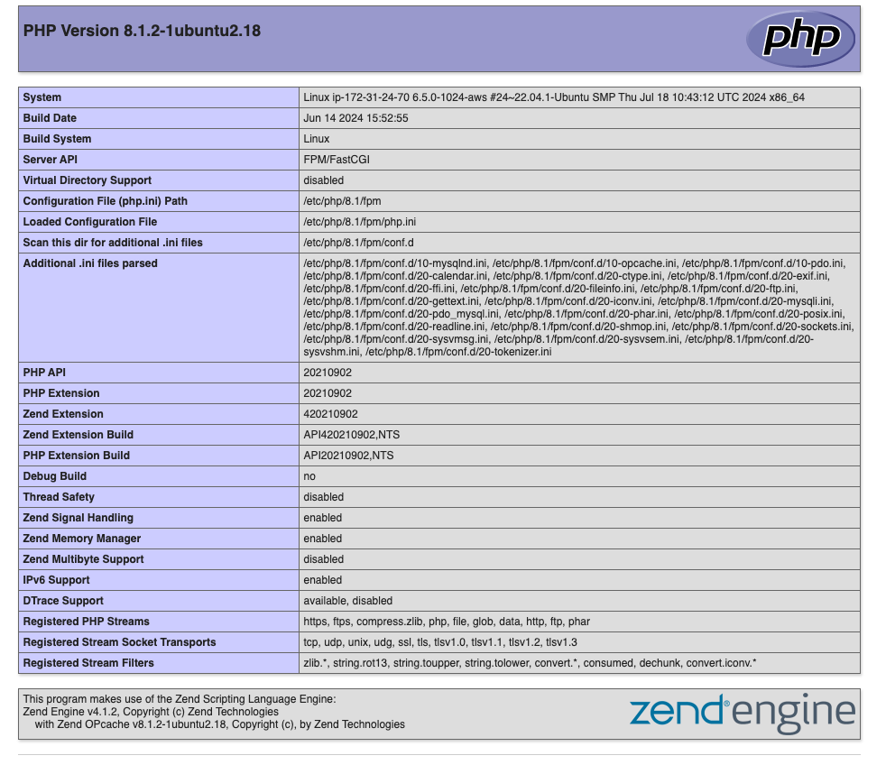

# LEMP Stack Deployment on Ubuntu

## Overview

This project demonstrates the deployment of a LEMP (Linux, Nginx, MySQL, PHP) stack on an Ubuntu server. The provided `setup-script.sh` script automates the installation and configuration of Nginx, MySQL, and PHP. Additionally, it sets up a basic PHP application to test the stack's functionality.

## Prerequisites

- An Ubuntu server (18.04 or later)
- Root or sudo access to the server

## Setup Instructions

### 1. Clone the Repository

Clone the repository to your local machine or directly to your server:

```bash
git clone https://github.com/phsinghka/lemp-stack-deployment.git
cd lemp-stack-deployment
```

### 2. Review the Script

Before running the script, review `setup-script.sh` to ensure it meets your requirements. Make any necessary adjustments, especially to passwords and configuration settings.

### 3. Make the Script Executable

Ensure that the script is executable:

```bash
chmod +x setup-script.sh
```

### 4. Run the Script

Execute the script to set up the LEMP stack:

```bash
sudo ./setup-script.sh
```

### 5. Verify Installation

- **Nginx:** Visit your server's IP address in a web browser. You should see the PHP info page displaying information about your PHP installation.

- **PHP Test:** Navigate to `http://your-server-ip/test_db.php` to check the database connection. You should see "Connected successfully" if everything is set up correctly.

## Script Breakdown

The `setup-script.sh` script performs the following actions:

1. **System Update:**
   Updates and upgrades the system packages.

2. **Nginx Installation:**
   Installs Nginx and starts the service. Configures Nginx to serve a PHP application.

3. **MySQL Installation:**
   Installs MySQL server and runs a secure installation process. Sets up a database and user for the PHP application.

4. **PHP Installation:**
   Installs PHP and necessary extensions.

5. **Nginx Configuration:**
   Creates and enables a server block configuration for Nginx to serve PHP files.

6. **PHP Test Files:**
   Creates a basic `index.php` file to display PHP configuration information and a `test_db.php` file to test MySQL connectivity.

7. **Database Setup:**
   Creates a MySQL database and user with the appropriate privileges.


### **Screenshots**

1. **PHP Info Page:**
   

2. **Database Test Page:**
   
